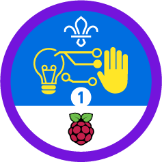

# Raspberry Pi Scouts activities and resources 



Find the resources and activities online at [fundraising.scouts.org.uk/raspberrypi](https://fundraising.scouts.org.uk/raspberrypi)

## Activity structure

All activities should be contain within the own repository in [github.com/raspberrypilearning](https://github.com/raspberrypilearning) with the name `scouts-[name_of_activity]` and have the following structure as per the [template directory](https://github.com/raspberrypilearning/scouts/tree/master/template).

```
/
    /language - the language, the default being en
        content.md - as markdown
        /images - as png
        /resources - anything required to complete the project
        /solutions - completed activities or solutions 
        /assets - design assets (PDFs, etc)
    README.md
    LICENSE.md
```

## Contributing
See [CONTRIBUTING.md](CONTRIBUTING.md)

## Licence
See [LICENSE.md](LICENSE.md)
