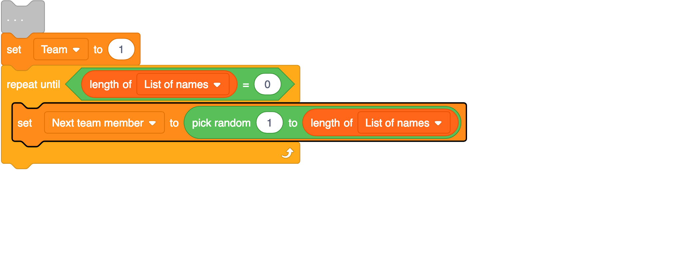

# Scratch team chooser

# Leader notes

## Overview

This activity fulfills Stage 2, Requirement 3 of the Digital Maker Staged Activity Badge (Make a simple digital creation that uses code to interact with the wider world through inputs (such as buttons or typing on a keyboard) and outputs (such as a computer screen, sound, or lights).

Young people will create a program on Scratch that will allow a user to enter a list of names and the number of teams they would like. Then the program will create random teams and display them on the screen.

## Information 

+ Time - 45 minutes 
+ Group size -  solo or pairs
+ Preparation needed - If you’re running this activity without access to the internet, you will need to download the software ahead of time. You may also wish to print handouts.
+ Location - Wherever you have computer access

## You will need

+ Laptops or desktop computers
+ One per solo or pair
+ Scratch either onlinee or offline
+ Activity handouts

### If your meeting place has internet access

Run Scratch online in a web browser with an internet connection using this link rpf.io/scratchon.

### If your meeting place doesn’t have internet access

Download the Scratch Desktop application beforehand; refer to the Scratch guide rpf.io/scouts-scratch for instructions. 

## Key messages

+ We can interact with computers using external inputs from devices like keyboards.
+ We can make short programs that can solve tasks that you often face.

## Leader instructions
+ If they have not used Scratch before, introduce the young people to it. Explain that they will be coding using blocks that join together like Lego. Explain that the blocks are colour-coded to make them easy to find. 
+ Demonstrate writing a very simple program (perhaps move the Scratch cat or make it say something) and demonstrate testing it.
+ Explain when the young people could use their team chooser. They could use it to pick groups for a game or activity.

## Alternatives

+ Create a similar program using different technology (perhaps try with a micro:bit if it's available).

## Safety

If the young people are working online, tell them to ask for permission before viewing any other websites. It’s a good idea to set up parental controls — you can find instructions for this on the NSPCC website (rpf.io/scouts-nspcc-online).

You should also give each young person a Stay Safe leaflet (rpf.io/scouts-staysafe).

## Adaptability

+ You can learn more about using sprites in Scratch by experimenting with the Scratch cat. Try to make it move or point when calling out the names.

## Community and sharing

+ You can share Scratch projects on the Scratch website by logging in and using the share option.
+ You can share your program with younger groups who might need help picking teams but may not have started to learn any coding.

# Activity / project title

# Handout

You are going to make a computer program using Scratch that will let you enter in a list of names and a number of desired teams, then it will randomly divide the names into your desired amount of teams. This will be useful when you need to split a group into smaller groups for games and activities during your weekly meetings or at camp.

## Did you know

+ The very first version of Scratch was built in 2003!

## Instructions

### Part 1: Getting input from the keyboard

First you will create a new Scratch project and get the list of names and number of teams from the user.

1. When you open scratch, make sure you are using a new project. To do this click File -> New

2. You will need a `variable` and a `list` to store the number of teams and the list of names. To create a new variable, select Make a Variable from the **variables** menu. Name it `Number of teams` and select OK.


3. To create a new list, select Make a List from the **variables** menu. Then give it a name (e.g., `List of names`). Then select OK.

4. Add a `when green flag clicked` block to the program from the **Events** menu.


5. Next, you will ask the user for the number of teams they would like. Add an `ask and wait` block beneath the `green flag clicked` block. You can find it in the **Sensing** menu. Enter the question "How many teams would you like?" into the blank space in this block.


6. To put the user's answer into our variable `Number of teams`, Add a `set my variable to` block beneath the `ask and wait` block. Be sure to change `my variable` to `Number of teams` using the drop down menu! You can find this block in the **Variables** menu. To finish this step add an `answer` block and drop it into the space in the `set` block. You can find it in the **Sensing** menu. The answer block will store the answer that the user gives to the `ask and wait` question.


7. It's important to test our code often, click the green flag and the Scratch cat should ask you the question "How many teams would you like?". Enter a number, press enter and you should see the result in the box for our variable at the top!

8. Now to get the list of names, you are going to use a `repeat until` loop. First, add an `ask and wait` block beneath the `set` block with the instruction "Add a name or enter 'Done'". This will get the first name for you.


9. Next, add a `repeat until` block beneath your `ask and wait` block. Use the `=` operator block to keep checking if the user enters the word `Done`. Inside your loop, add an `add to list` block and another `ask and wait` block to repeat the instruction. Check below to make sure you code is in the correct order.


10. To finish this part, test your code once more. Can you see your list fill up? If you run it a few times, you should notice the list keeps the old names. Since we don't want this, let's `delete all of` our list. Add the block to do this at the start of our code, directly underneath the `green flag clicked` block.


For testing the program from here on out you might get tired of entering names. You can swap the code as below to make testing easier by automatically filling the list. Remember to keep the code you have already written to the side, for later.


### Part 2: Displaying the teams.

Now you will go through your list and assign a random name to a team and for each name you will change the team number to keep the amount of names per team as fair as possible. Then you will get the Scratch cat to say each name and the team they get.

1. Create 2 new variables called `Team` that will store the current team and `Next team member` to store the next team member.

2. Set the new variable `Team` to 1 using a `set to` block and add it to the bottom of your code.


3. Add a `repeat until` block and make it repeat until length of the list is equal to 0.


4. Set the `Next team member` variable to a random number between 1 and the length of the list of names using the `pick random` block.



5. Use a `say for 2 seconds` block inside the `repeat until` block, which can be found in the **looks** menu, to assign the `Next team member` name in your list to the current team. You will need to join some blocks together for this, see below for help.


6. Delete that name in the list using the `delete` block and increase the Team variable by 1 using a `change by` block.


7. You need to make sure the Team variable never goes above the amount of teams the user entered. Add an `if then` block to check for this and set Team back to 1 if it happens.


8. Finally Test your code and make sure everything works, you should see the Scratch cat announce each name with a team number beside it and see the list slowly empty as each name is displayed. If your code is working as expected, you can add your code from part one back in.


**THE BELOW CODE IS FOR SCRATCHBLOCKS.GITHUB.IO AND NOT PART OF THE RESOURCE**
```
when green flag clicked
delete all of [List of names v]
ask [How many teams would you like?] and wait
set [Number of teams v] to (answer)
ask [Add a name or enter 'Done'] and wait
repeat until <(answer) = [Done]>
add (answer) to [List of names v]
ask [Add a name or enter 'Done'] and wait
end
set [Team v] to [1]
repeat until <(length of [List of names v]) = [0]>
set [Next team member v] to (pick random [1] to (length of [List of names v]))
say (join(item(Next team member) of [List of names v]) (join[ is in Team: ](Team))) for [2] seconds
delete (Next team member) of [List of names v]
change [Team v] by [1]
if <(Team) > (Number of teams)> then
set [Team v] to [1]
end
end
```

## Discuss

What type of games or activities could you use this program for?

Think about what it means to be a good team member. Ask your young people to think about all the different types of teams they are part of? It may be a sports team, school team or scout team. 

## Tip

If you need a block that you have already used, you can **duplicate** it instead of searching for it again. 
