# Scratch team chooser

# Leader notes

## Overview

This activity fulfills Stage 2, Requirement 3 of the Digital Maker Staged Activity Badge (Make a simple digital creation that uses code to interact with the wider world through inputs (such as buttons or typing on a keyboard) and outputs (such as a computer screen, sound, or lights).) and Stage x, Requirement x of the Give other badge links here. 

Young people will create a program on Scratch that will allow a user to enter a list of names and the number of teams they would like. Then the program will create random teams and display them on the screen.

## Information 

+ Time - 60 minutes 
+ Group size -  solo or pairs
+ Preparation needed - If you’re running this activity without access to the internet, you will need to download the software ahead of time. You may also wish to print handouts.
+ Location - Wherever you have computer access

## You will need

+ Laptops or desktop computers
  + One per solo or pair
+ Scratch either onlinee or offline
+ Activity handouts

### If your meeting place has internet access

Run Scratch online in a web browser with an internet connection using this link rpf.io/scratchon.

### If your meeting place doesn’t have internet access

Download the Scratch Desktop application beforehand; refer to the Scratch guide rpf.io/scouts-scratch for instructions. 

## Key messages

+ These will be what the leaders need to draw out in any discussion
+ As well as the key learning points that the activity is trying to get the 

## Leader instructions
1. Stepped instructions describing how the leader should deliver / present the activity

## Alternatives

+ State whether tech-free version available (what we’ve been calling unplugged)
+ Give other adaptations available.

## Safety

If the young people are working online, tell them to ask for permission before viewing any other websites. It’s a good idea to set up parental controls — you can find instructions for this on the NSPCC website (rpf.io/scouts-nspcc-online).

You should also give each young person a Stay Safe leaflet (rpf.io/scouts-staysafe).

## Adaptability

Here other badge resources primarily cover how you’d adapt this for different educational needs

## Community and sharing

How the output or ideas from the activity might be shared with others. 

# Activity / project title

# Handout

You are going to make a computer program using Scratch that will let you enter in a list of names and a number of desired teams, then it will randomly divide the names into your desired amount of teams. This will be useful when you need to split a group into smaller groups for games and activities.

## Did you know

+ A relevant relating to the activity.

## Instructions

### Part 1: Getting input from the keyboard

First you will create a new Scratch project and get the list of names and number of teams from the user.

1. When you open scratch, make sure you are using a new project. To do this click File -> New

2. Add a `green flag clicked` block to the program from the **Events** menu.

3. You will need a `variable` and a `list` to store the number of teams and the list of names. To create a new variable, select Make a Variable from the **variables** menu. Then give it a name (e.g., `Number of teams`). Then select OK.

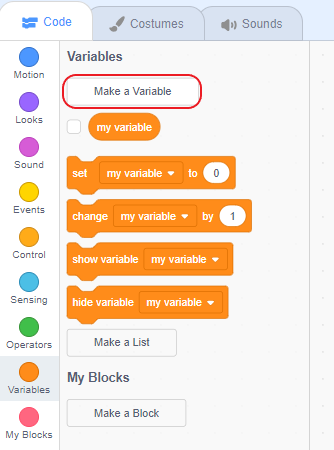

4. To create a new list, select Make a List from the **variables** menu. Then give it a name (e.g., `List of names`). Then select OK.

5. Next, you will ask the user for the number of teams they would like. Add an `ask and wait` block beneath the `green flag clicked` block. You can find it in the **Sensing** menu. Enter the question "How many teams would you like?" into the blank space in this block.

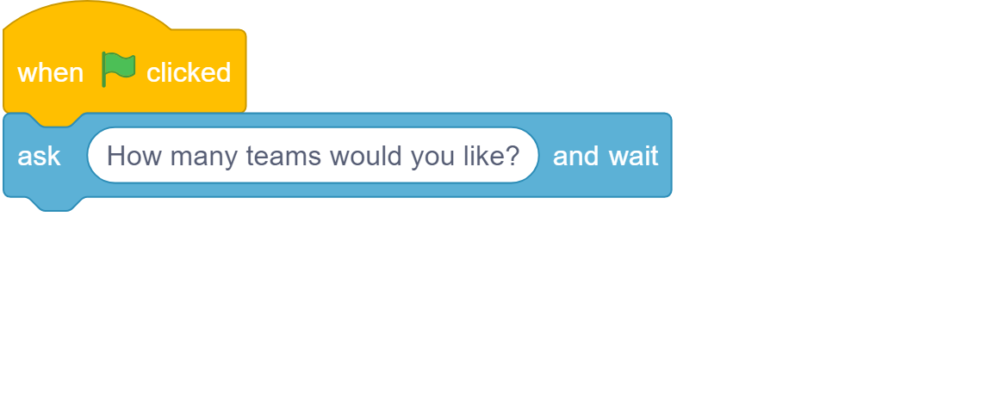

6. To put the user's answer into our variable `Number of teams`, Add a `set my variable to` block beneath the `ask and wait` block. Be sure to change `my variable` to `Number of teams` using the drop down menu! You can find this block in the **Variables** menu. To finish this step add an `answer` block and drop it into the space in the `set` block. You can find it in the **Sensing** menu.

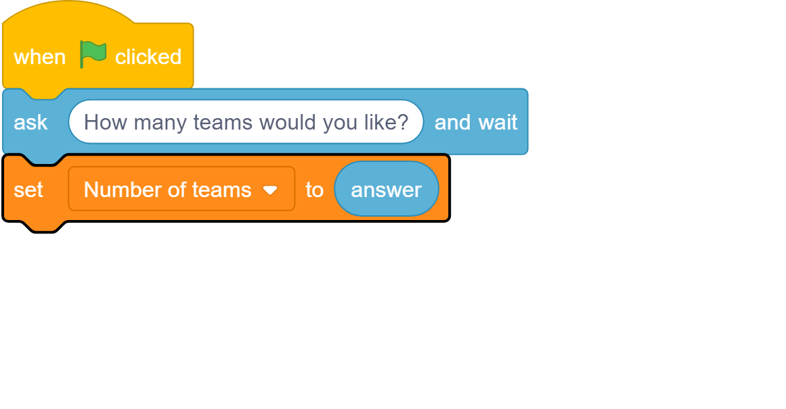

7. It's important to test our code often, click the green flag and the Scratch cat should ask you the question "How many teams would you like?". Enter a number, press enter and you should see the result in the box for our variable at the top!

8. Now to get the list of names, you are going to use a `repeat until` loop. First, add an `ask and wait` block beneath the `set` block with the instruction "Add a name or enter 'Done'". This will get the first name for you.

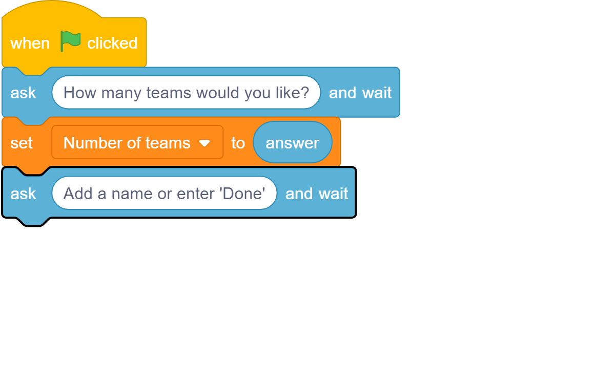

9. Next, add a `repeat until` block beneath your `ask and wait` block. Use the `=` operator block to keep checking if the user enters the word `Done`. Inside your loop, add an `add to list` block and another `ask and wait` block to repeat the instruction. Check below to make sure you code is in the correct order.

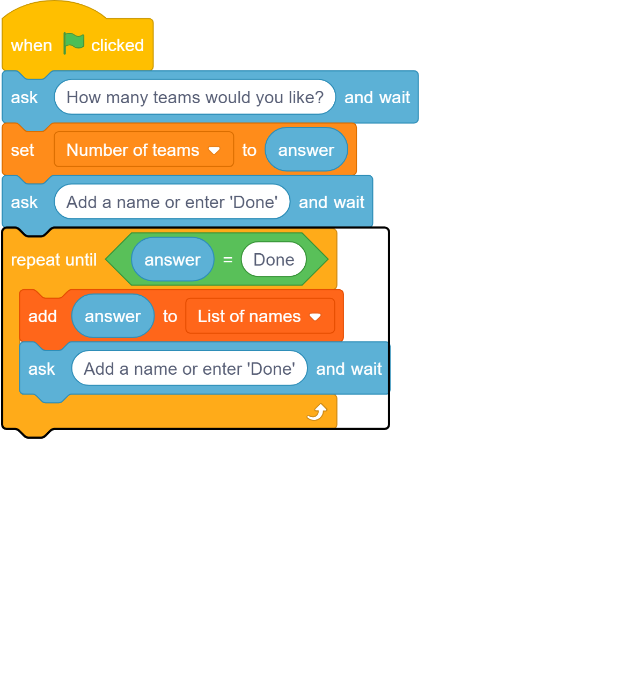

10. To finish this part, test your code once more. Can you see your list fill up? If you run it a few times, you should notice the list keeps the old names. Since we don't want this, let's `delete all of` our list. Add the block to do this at the start of our code, directly underneath the `green flag clicked` block.

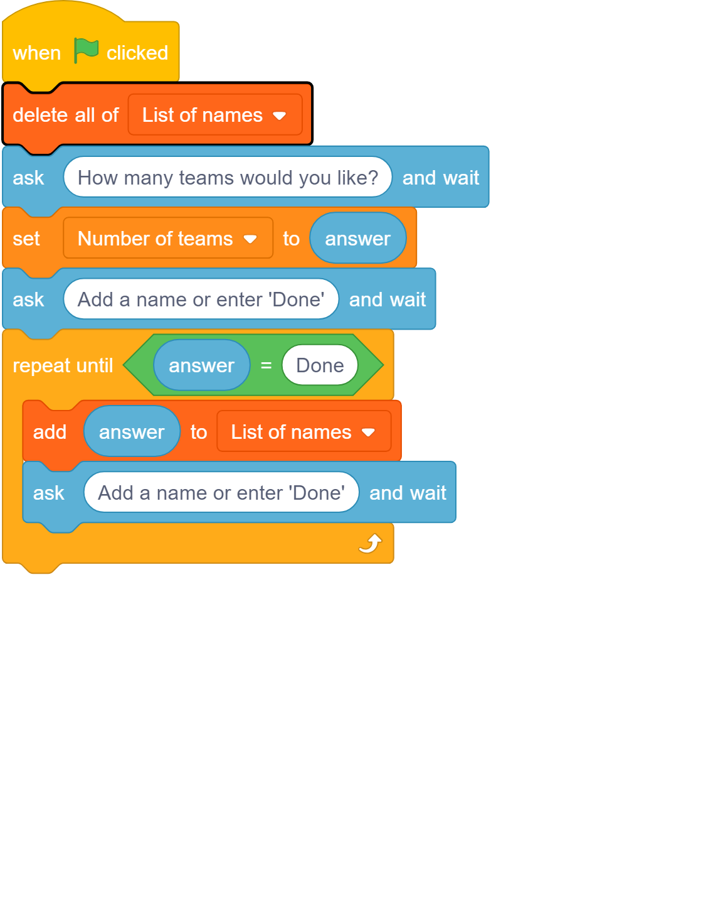

### Part 2: Shuffling your list of names

For the shuffle, you will swap the last item in your list with a random one. Then move to the second last one and swap again. Then repeat until you get to the start of our list.

1. First you will need 3 new variables. Create these now and call them `i`, `j` and `temp`. You can select the checkbox on these variables to make them invisible on the stage if you like.

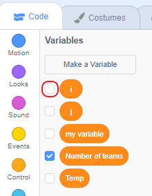

2. Set `i` to the length of your list (which is also the position of the last item). Add this block to the bottom of your code.

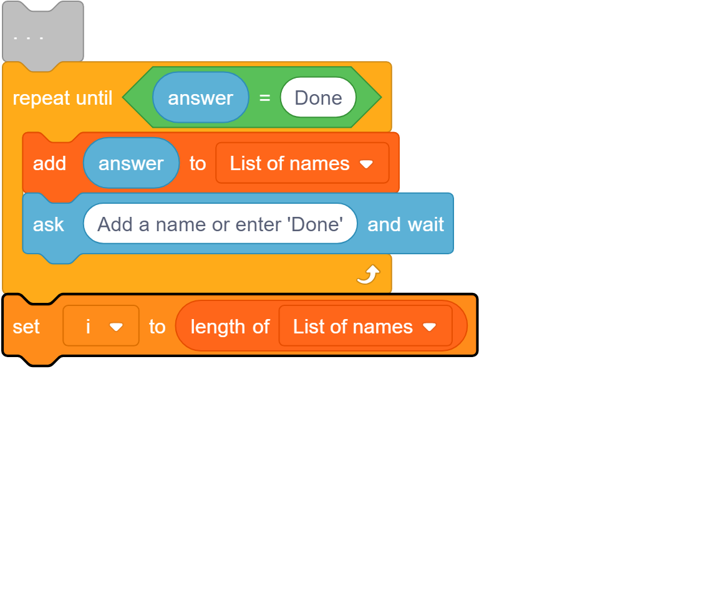

3. Add a `repeat until` block to the bottom of your code. Then add the blocks below to the inside of it. You can find the blocks in the **variables** and **operators** menus. These blocks will perform the swap described at the start of Part 2.

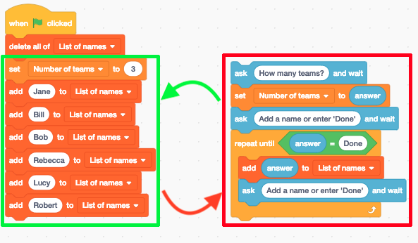

4. Test your code, when you click the green flag, enter a number and enter some names, you should see the list randomly shuffle on the stage! If you have any issues, carefully look over the code added in the last step.

### Part 3: Displaying the teams.

Now you will go through your list and assign a name to a team and for each name you will change the team number to keep the amount of names per team as fair as possible. Then you will get Scratch cat to say each name and the team they get.

1. Create a new variable called `Team`, this will store the current team.

2. Set this new variable to 1 using a `set to` block.

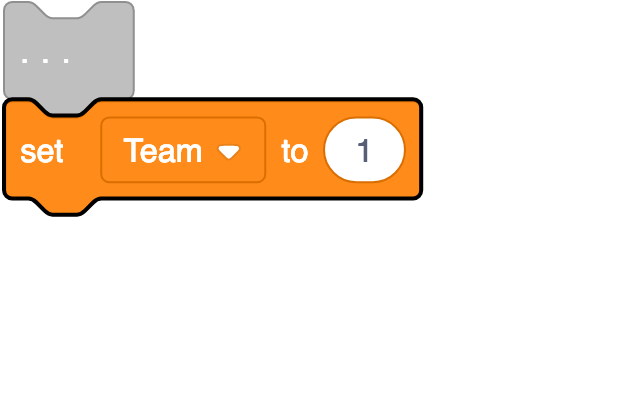

3. Add a `repeat until` block and make it repeat until length of the list is equal to 0.

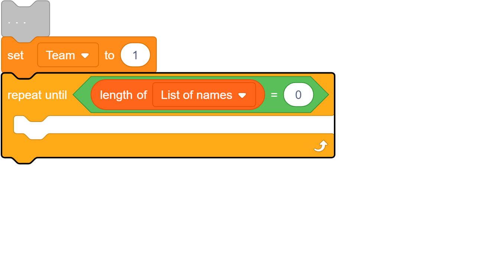

4. Use a `say for 2 seconds` block inside the `repeat until` block, which can be found in the **looks** menu, to assign the first name in your list to the current team. You will need to join some blocks together for this, see below for help.

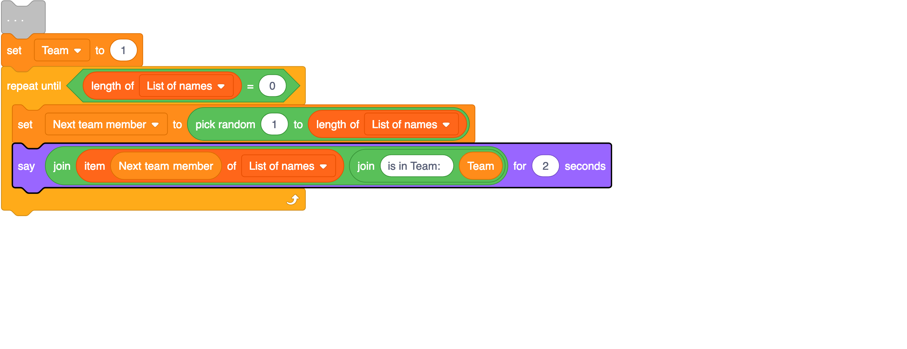

5. Delete the first name in the list using the `delete` block and increase the Team variable by 1 using a `change by` block.

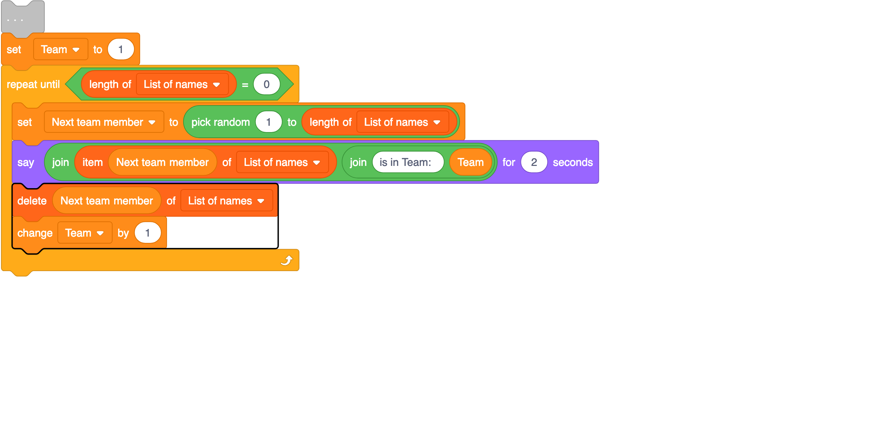

6. You need to make sure the Team variable never goes above the amount of teams the user entered. Add an `if then` block to check for this and set Team back to 1 if it happens.

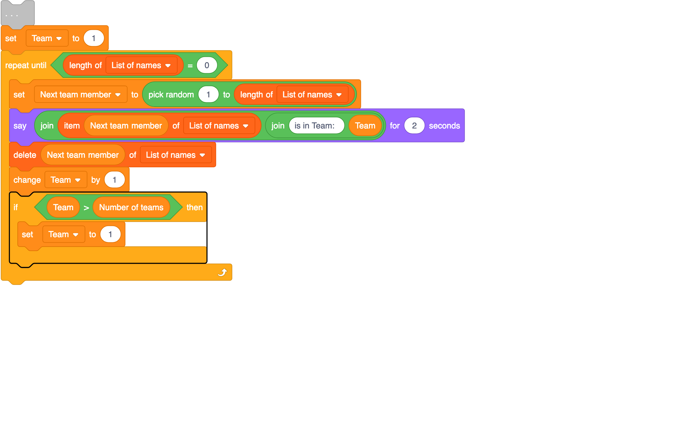

7. Finally Test your code and make sure everything works, you should see the Scratch cat announce each name with a team number beside it and see the list slowly empty as each name is displayed. 

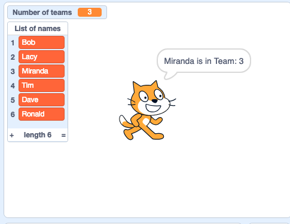

## Discuss

A question related to the activity which they can discuss in a small group. (Discuss what happens in a swap with a temp variable?)

## Tip

Any tips which may help the Scouts engage or get more from the activity.
